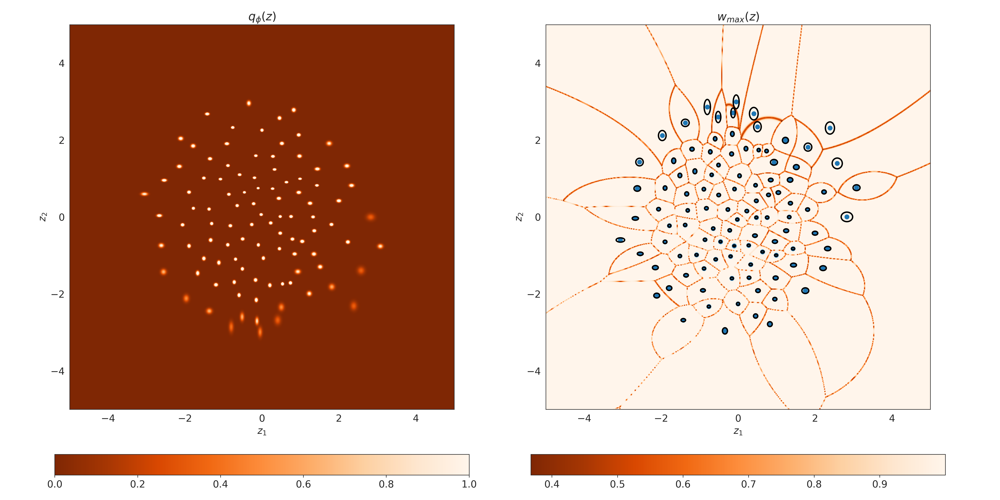
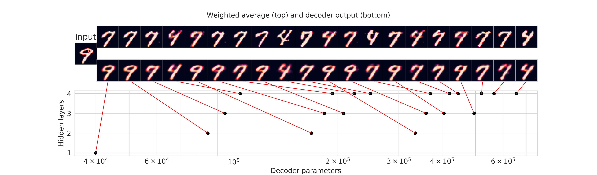
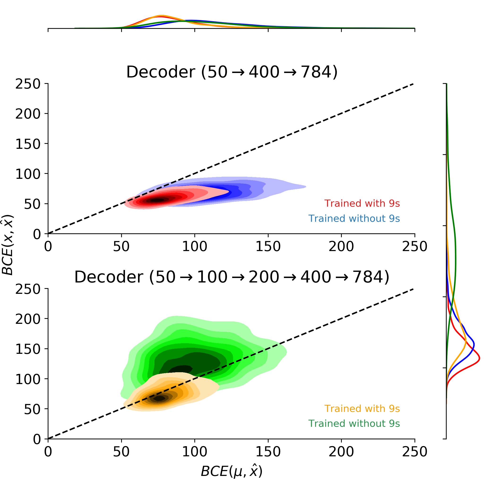
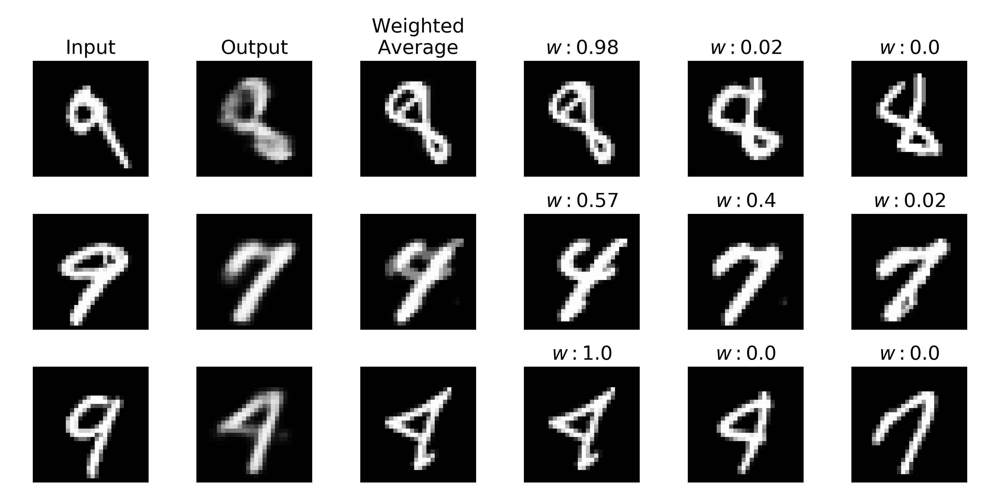
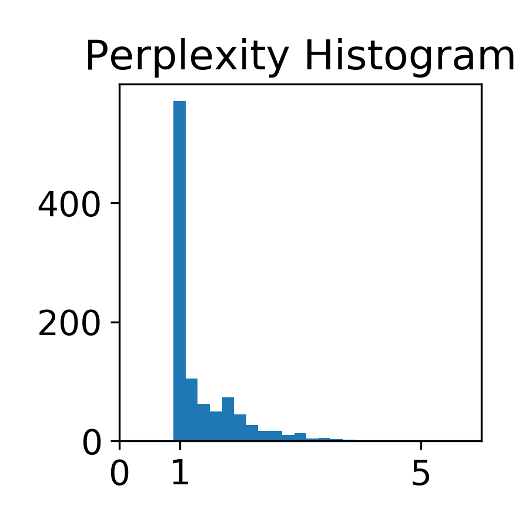

# vae_novel_examples
Code to reproduce experiments for  
A Bozkurt, B Esmaeili, DH Brooks, JG Dy, JW van de Meent. *Can VAEs Generate Novel Examples?*
In _Critiquing and Correcting Trends in Machine Learning Workshop at NeurIPS 2018_

The paper, poster, and slides are available at https://alicanb.github.io/publication/cract-vae/


If you use this code in your research please cite the paper:
```
@article{bozkurt2018can,
  title={Can VAEs Generate Novel Examples?},
  author={Bozkurt, Alican and Esmaeili, Babak and Brooks, Dana H and Dy, Jennifer G and van de Meent, Jan-Willem},
  journal={arXiv preprint arXiv:1812.09624},
  year={2018}
}
```

### Reproducing figures
Training all models should take around 10 hours. Instead download the pretrained models:

```python download_models.py```

Codes for generating figures:

```python plot_agg_posterior.py --num-points 1000```


```python plot_capacity_vs_reconstruction.py```


```python plot_kde_bce.py```


```python plot_compare_recons_wavg.py --enc-arch 400 200 100 --holdout```


```python plot_compare_recons_wavg.py --enc-arch 400 200 100 --holdout```

